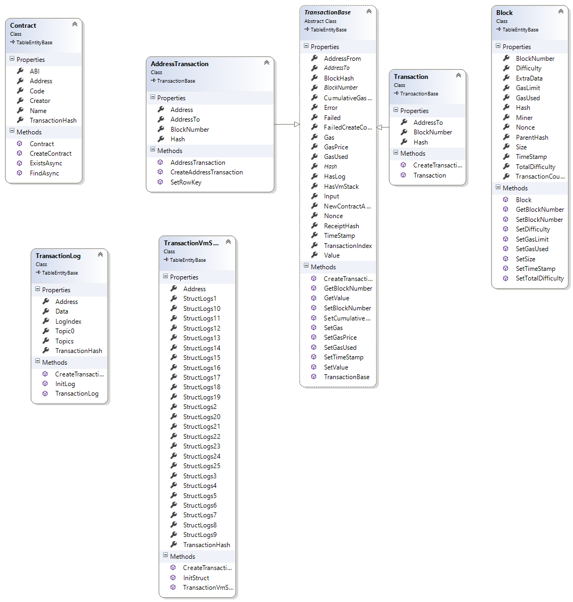

# ujo-backend-spike

Initial spike (prototype) for a backend in Azure to process blockchain data, events etc, store them and index the information for searching.

## Components

###[Blockchain Service](https://github.com/ConsenSys/ujo-backend-spike/tree/master/UjoSpike.Service)
Service wrapper for a contract, including event, function calls.

###[Console Application (Helper)](https://github.com/ConsenSys/ujo-backend-spike/tree/master/UjoSpike.ArtistWriter.Console)
Application with different helper methods to
* Deploy the contract
* Populate with artists
* Retrive the artists

Morden contract "0x77caa46901bbad6e6f19615643093dff7bc19394"

###[Simple Contract](https://github.com/ConsenSys/ujo-backend-spike/tree/master/contracts)
A simple artist contract to register Artists

###[Web Job](https://github.com/ConsenSys/ujo-backend-spike/tree/master/UjoSpike.WebJob)
The web job pulls the information from the contract and stores it in an Azure Table Storage
Deployed to https://manage.windowsazure.com/@andrewkeysconsensys.onmicrosoft.com#Workspaces/WebsiteExtension/Website/ujobackendspike/jobs
* Configured to use a timer (runs every minute)
* Connects to a public rpc (Augur in Morden)
* Checks for the current processed and writes new artists added to Azure Table storage
Account: ujostorage
Table: ArtistEntity
NOTE Configuration settings are held in Azure

###Azure search integration
Azure search is integrated with tables, created an indexer that runs every 15 minutes.
See [Postman settings](https://github.com/ConsenSys/ujo-backend-spike/blob/master/AzureSearch_PostManIndexers.txt)
Deployed on Azure ujosearch

###[Web page search sample](https://github.com/ConsenSys/ujo-backend-spike/tree/master/UjoSpike.Web)
Very simple web search sample connecting to Azure Search
See demo: http://ujobackendspike.azurewebsites.net/
Search for [content registered here](https://github.com/ConsenSys/ujo-backend-spike/blob/master/UjoSpike.ArtistWriter.Console/RegisterArtists.cs)

###[Blockchain Store](https://github.com/ConsenSys/ujo-backend-spike/tree/master/Ethereum.BlockchainStore)
Library to store the blockchain in Azure Table Storage, which will allow specific Blockchain Services to retrieve its data, as opposed to having a direct dependency with geth. Partionkeys and rows are indexed in a way so that services can retrieve information specific for their contracts (or vice versa).

Later TODO:
Queueing to HdInsight and PowerBI ...
